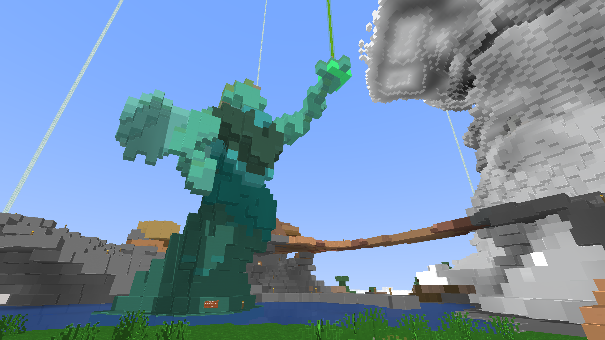

# ProcStack's procPromo v0.2
### Optifine Shader Pack
*Inpired by Mojang's [promo art style](https://www.minecraft.net/content/dam/games/minecraft/key-art/nether-header.jpg) for Minecraft
<br/> Those [Cartoonized](https://www.minecraft.net/content/dam/games/minecraft/key-art/CC-Part%20I-Announce-Header.jpg) Vibes
<br/> Softer details, edge highlights, sharp shadows, and glowiness.*


***Vanilla vs procPromo***


*(More screenshots in [/show](/show/ReadMe.md))*

---

### Under the hood
#### Style'n'Stuff
<null/> - Texture details in your world will be blended together giving a softer look
<br/> - A glow illuminating the presence of light blocks, particles, & other fitting things.
<br/> - Edge highlights to make the environment pop that little bit more.
<br/>&nbsp;      <sub>( Minihud's Shapes and Overlays are supported, yeee )</sub>

#### Video Settings > Shaders > Shader Options
<null/> - `DetailBluring` - How much block bluring is killing your game's vibe
<br/> - `LightingBrightness` - Master slider for that final, whole kitten kaboodle, last touch of brightness multiplication
<br/> - `EdgeShading` - Edge highlightings influence percent
<br/> - `GlowBrightness` - Change how much snow blindess you get while playing the game

<br/> - `SolidLeaves` - Don't like the solid leaves? Turn off those bubblicious bubble gum blocks 
<br/> - `UnderWaterBlur` - Ever open your eyes under water? Yeah, its all blur and wobbly.  Get your Water vision Here!
<br/> - `GreyWorld` - To heck with block colors!
<br/>

---
---


### Creator's Notes

Ayo, I'm Kevin

This is my first shader pack for Optifine,
<br/>&nbsp; It's been quite a journey so far.

I wanted to build the backbone for a general purpose shader pack.
<br/>&nbsp; A short term project to rip appart for future shader packs.
<br/>&nbsp; Hmm, like growing a full plant just by using clippings

Mojang's promotion art has quite a homely feel to me.
<br/>&nbsp; So heck, a solid idea to shoot for on a shader pack!

Since I had no footing for Optifine's environment,
<br/>&nbsp; I looked toward 3 packs to learn from.
<br/>&nbsp;      <sub>(Listed Below)</sub>

Gotta love personal projects though,
<br/>&nbsp; Such a cathartic release from a long day.

---

### My Working Environment
```
  _ Nvidia 1080 GTX @ 4k
  _ Nvidia RTX 3080 Laptop @ 2.5k
  _ Minecraft 1.18.1-1.20.2
  _ Optifine, Fabric, Optifabric, & Minihud
```

If you get any insano color glitches;
<br/>&nbsp; I'd love to see em!


---

### Edu & Inpiration
Mojang's Promotional Art style'n'vibe!
<br/>Their ads & splash images in the launcher

#### Shadow Inspiration and Learning Model
*[Chocapic13's HighPerformance Toaster](https://www.curseforge.com/minecraft/customization/chocapic13-high-performance-shaders)*

#### Optifine's Shader Environment Learning Models
*[Capt Tatsu's BSL Shaders v8](https://bitslablab.com)*
<br>*[Sildur's Vibrant shaders](https://www.curseforge.com/minecraft/customization/sildurs-vibrant-shaders)*


