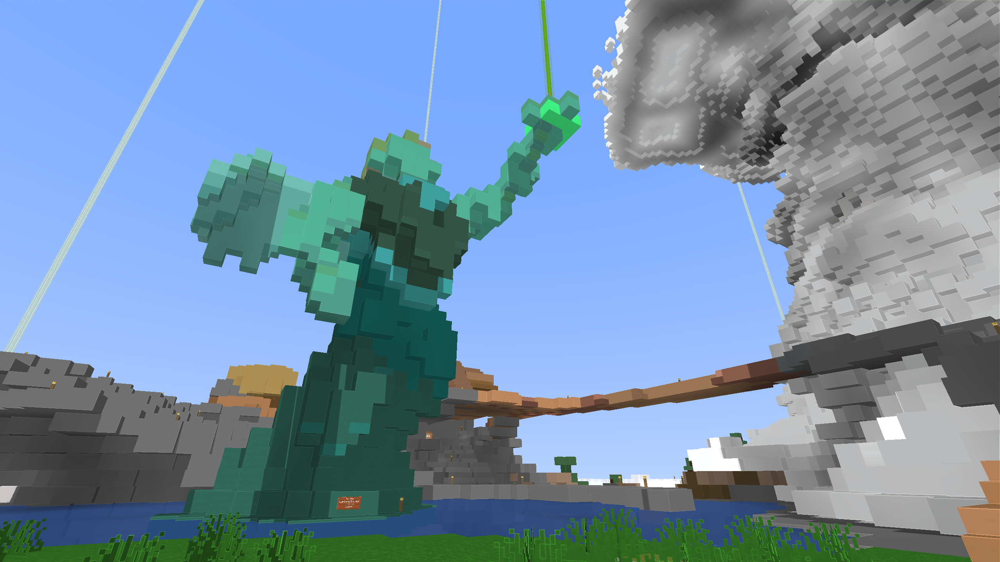
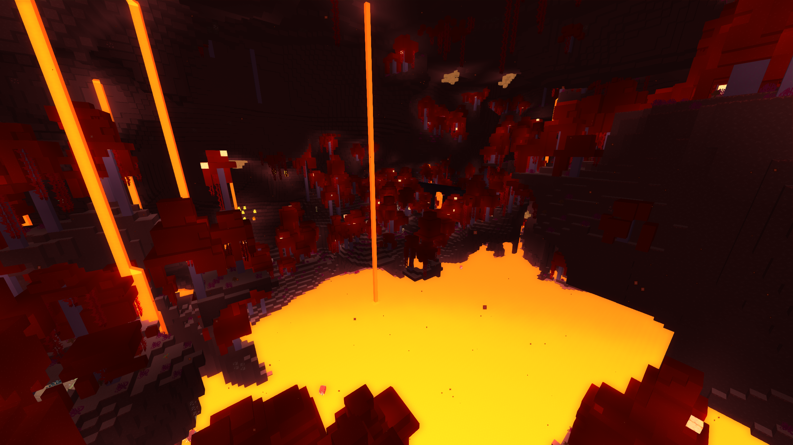

# ProcStack's procPromo v0.6.2
### Optifine & Iris Shader Pack
#### MC 1.21.11; Mounts of Mayhem

*Inpired by Mojang's [promo art style](https://www.minecraft.net/content/dam/games/minecraft/key-art/nether-header.jpg) for Minecraft
<br/> Those [Cartoonized](https://www.minecraft.net/content/dam/games/minecraft/key-art/CC-Part%20I-Announce-Header.jpg) Vibes
<br/> Softer details, edge highlights, sharp shadows, and glowiness.*
---






*(More screenshots in [/show](/show/ReadMe.md))*

---

### Some Iris Love
As of **June 15th 2025**, **Iris** for **Fabric** *( Sodium Renderer )* is now working!
<br/>&nbsp; It took me some time to work out the Shadow matrix issues,
<br/>&nbsp; Among lighting and general differences between Optifine & Iris.
<br/>&nbsp;&nbsp;&nbsp; Fun times!

---

### Under the hood
#### Style'n'Stuff
<null/> - Texture details in your world will be blended together giving a softer look
<br/> - A glow illuminating the presence of light blocks, particles, & other fitting things.
<br/> - Edge highlights to make the environment pop that little bit more.
<br/>&nbsp;      <sub>( Minihud's Shapes and Overlays are supported, yeee )</sub>

---

#### Video Settings -> Shaders / Shader Packs -> Shader Options / Settings
<null/> - `Base Quality` - Reduce the ammount of texture blurring samples, heavier math functions, and performance slow downs.
<br/>&nbsp;&nbsp; The other options denote fidelity, this option is how that fidelity is utilized.
<br/>&nbsp;&nbsp; Note - Color blindness math in `World Colors` is an estimate on Low & Mid `Base Quality` settings for performance; if it's an issue, please contact me.
<br/><br/> - `Dark Color Levels` - How dark any colors can get.
<br/>&nbsp;&nbsp; Set this higher if you are a streamer or recording video.
<br/><br/> - `Bright Color Levels` - How bright any colors can get.
<br/>&nbsp;&nbsp; Set this lower if things are too bright.
<br/>&nbsp;&nbsp; Set this higher if you want to see the light!
<br/><br/> - `Glow Amount` - How blinded the glow makes you
<br/><br/> - `Fog Amount` - Is the fog limiting your vision? Heck with it!
<br/>&nbsp;&nbsp; Or if you want to be playing Silent Hill
<br/><br/> - `Detail Bluring` - How much block bluring is killing your game's vibe
<br/><br/> - `Edge Outlines` - Want some of those thick lines on your blocks?
<br/>&nbsp;&nbsp; Or maybe it's too thick

<br/><br/> - `Under Water Effects` - Ever open your eyes under water?
<br/>&nbsp;&nbsp; Yeah, its all blur and wobbly.
<br/>&nbsp;&nbsp;&nbsp;&nbsp; Get your Water vision Here!
<br/>&nbsp;&nbsp; If you are getting sick underwater, turn this off
<br/><br/> - `Solid Leaves` - Don't like the solid leaves? Turn off those bubblicious bubble gum blocks 

<br/><br/> - `Shadow Quality` - How good does that shadow look?
<br/><br/> - `Shadow Resolution` - Shadow look too blocky? Set it higher! 4096-8192
<br/>&nbsp;&nbsp; Your computer fans sound like jet engines? Set this lower, 1024-2048
<br/><br/> - `Debug Vision` - This one's mostly for me, while developing the shader.
<br/>&nbsp;&nbsp; Set the `Shadow Cam` to see what the sun/moon is seeing
<br/><br/> - `World Colors` - For the major color blindness types of `Protanopia`, `Deuteranopia`, & `Tritanopia`
<br/>&nbsp;&nbsp; And Greyscale for fun!
<br/>&nbsp;&nbsp;&nbsp;&nbsp; See if you can beat the dragon in greyscale!
<br/>


---
---
---


### Creator's Notes

Ayo, I'm Kevin

This is my first shader pack for Optifine, (now with Iris support!)
<br/>&nbsp; It's been quite a journey so far.
<br>&nbsp;&nbsp;&nbsp; *(Nearly 4 years later now, end 2025; legacy-code creep is now a thing, hahah)*

I wanted to build the backbone for a general purpose shader pack.
<br/>&nbsp; A short term project to rip appart for future shader packs.
<br/>&nbsp; Hmm, like growing a full plant just by using clippings

Mojang's promotion art has quite a homely feel to me.
<br/>&nbsp; So heck, a solid idea to shoot for on a shader pack!

Since I had no footing for Optifine's environment,
<br/>&nbsp; I looked toward 3 packs to learn from.
<br/>&nbsp;      <sub>(Listed Below)</sub>

Gotta love personal projects though,
<br/>&nbsp; Such a cathartic release from a long day.

*To Companies: This repo is a personal project in constant flux;
<br/>&nbsp; I make jokes in my comments and hide youtube videos in my code.
<br/>&nbsp;&nbsp;&nbsp; This is for fun and for a game;
<br/>&nbsp;&nbsp;&nbsp;&nbsp;&nbsp; Cleanliness is second to testing new ideas.

---

### Testing Environment
```
  _ Nvidia 1080 GTX @ 4k
  _ Nvidia RTX 3080 Laptop @ 2.5k
  _ Minecraft 1.18.1-1.20.4
  _ Optifine, Iris, Fabric, Optifabric, & Minihud
```

If you get any insano color glitches;
<br/>&nbsp; I'd love to see em!


---

### Edu & Inpiration
Mojang's Promotional Art style'n'vibe!
<br/>Their ads & splash images in the launcher

#### Shadow Inspiration and Learning Model
*[Chocapic13's HighPerformance Toaster](https://www.curseforge.com/minecraft/customization/chocapic13-high-performance-shaders)*

#### Optifine's Shader Environment Learning Models
*[Capt Tatsu's BSL Shaders v8](https://bitslablab.com)*
<br/>*[Sildur's Vibrant shaders](https://www.curseforge.com/minecraft/customization/sildurs-vibrant-shaders)*


